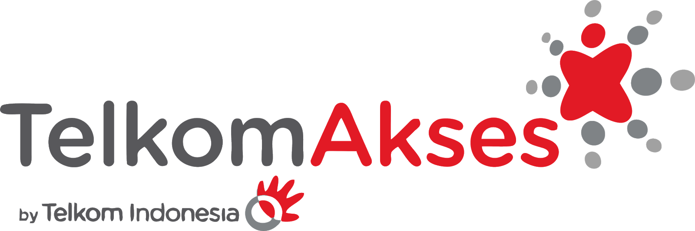

# DOKEMA - Sistem Manajemen Magang

<p align="center">
    
</p>

<p align="center">
    Sistem Manajemen Magang Terintegrasi dengan Workflow Approval
</p>

## Deskripsi Sistem

DOKEMA adalah sistem manajemen magang yang komprehensif yang dirancang untuk mengelola seluruh proses magang mulai dari pendaftaran, approval, pembimbingan, pelaporan, hingga penilaian akhir. Sistem ini dibangun menggunakan Laravel dengan interface yang modern dan responsif.

## Fitur Utama

### 📊 Dashboard Statistik

-   Overview total peserta magang
-   Status approval real-time
-   Grafik progress kegiatan
-   Monitoring pembimbingan

### 🔄 Workflow Approval

-   Sistem persetujuan otomatis
-   Pengecekan kuota departemen
-   Assignment pembimbing otomatis
-   Notifikasi approval/rejection

### 👥 Manajemen User

-   Role-based access control (Magang, HR, Pembimbing)
-   Profile management
-   User authentication

### 📝 Manajemen Data Magang

-   Pendaftaran peserta magang
-   Data profil peserta lengkap
-   Status tracking

### 📋 Sistem Pelaporan

-   Laporan kegiatan harian
-   Log bimbingan
-   Progress tracking

### ⭐ Penilaian Akhir

-   Form penilaian terstruktur
-   Scoring system
-   Export hasil penilaian

## Tech Stack

-   **Backend**: Laravel 11.x
-   **Frontend**: Blade Templates + Alpine.js
-   **Styling**: Tailwind CSS
-   **Database**: MariaDB/MySQL
-   **Icons**: Lucide Icons

## Instalasi

### Prerequisites

-   PHP >= 8.2
-   Composer
-   Node.js & NPM
-   MariaDB/MySQL

### Steps

1. **Clone Repository**

    ```bash
    git clone https://github.com/sukmaajidigital/dokema.git
    cd dokema
    ```

2. **Install Dependencies**

    ```bash
    composer install
    npm install
    ```

3. **Environment Setup**

    ```bash
    cp .env.example .env
    php artisan key:generate
    ```

4. **Database Configuration**
   Edit `.env` file:

    ```env
    DB_CONNECTION=mysql
    DB_HOST=127.0.0.1
    DB_PORT=3306
    DB_DATABASE=dokema
    DB_USERNAME=your_username
    DB_PASSWORD=your_password
    ```

5. **Database Migration & Seeding**

    ```bash
    php artisan migrate:fresh
    php artisan db:seed
    ```

6. **Build Assets**

    ```bash
    npm run build
    ```

7. **Start Development Server**
    ```bash
    php artisan serve
    ```

## Database Structure

### Core Tables

-   `users` - User management dengan role
-   `profil_peserta` - Data profil peserta magang
-   `data_magang` - Data pendaftaran dan status magang
-   `laporan_kegiatan` - Log kegiatan harian
-   `log_bimbingan` - Record sesi bimbingan
-   `penilaian_akhir` - Hasil penilaian peserta

### Workflow Tables

-   `workflow_notifications` - Notifikasi workflow
-   `workflow_history` - Riwayat approval

## Component Architecture

Sistem menggunakan Blade Components yang terstandarisasi:

### Layout Components

-   `x-admin-layouts` - Main admin layout
-   `x-sidebar` - Navigation sidebar
-   `x-admin-header` - Top header

### Form Components

-   `x-admin.form-input` - Enhanced input fields
-   `x-admin.form-select` - Dropdown selections
-   `x-admin.form-textarea` - Text areas
-   `x-admin.form-button` - Action buttons

### UI Components

-   `x-admin.table` - Data tables
-   `x-primary-button` - Primary actions
-   `x-secondary-button` - Secondary actions
-   `x-danger-button` - Destructive actions

Lihat [COMPONENTS.md](COMPONENTS.md) untuk dokumentasi lengkap komponen.

## User Roles

### 1. Magang (Peserta)

-   Mendaftar magang
-   Mengisi laporan kegiatan
-   Melihat status approval
-   Berkomunikasi dengan pembimbing

### 2. HR (Human Resources)

-   Manage user accounts
-   Approve/reject aplikasi magang
-   Monitor seluruh peserta
-   Generate reports

### 3. Pembimbing

-   Membimbing peserta magang
-   Input log bimbingan
-   Melakukan penilaian akhir
-   Monitor progress peserta

## API Routes

### Dashboard

-   `GET /dashboard` - Dashboard utama

### User Management

-   `GET /user` - List users
-   `POST /user` - Create user
-   `PUT /user/{id}` - Update user
-   `DELETE /user/{id}` - Delete user

### Magang Management

-   `GET /magang` - List data magang
-   `POST /magang` - Create magang data
-   `PUT /magang/{id}` - Update magang data

### Workflow

-   `GET /workflow/approval` - Approval dashboard
-   `POST /workflow/process` - Process approval

## Development Guidelines

### Code Standards

-   Follow PSR-12 coding standards
-   Use meaningful variable and method names
-   Implement proper error handling
-   Write comprehensive tests

### Component Guidelines

-   Use consistent component architecture
-   Follow single responsibility principle
-   Implement proper prop validation
-   Maintain accessibility standards

### Database Guidelines

-   Use migrations for schema changes
-   Implement proper foreign key constraints
-   Use seeders for test data
-   Follow naming conventions

## Testing

```bash
# Run PHPUnit tests
php artisan test

# Run specific test
php artisan test --filter=UserTest

# Generate coverage report
php artisan test --coverage
```

## Contributing

1. Fork repository
2. Create feature branch
3. Make changes dengan testing
4. Submit pull request

## Security

Jika menemukan vulnerability, silakan laporkan ke [security@sukmaajidigital.com](mailto:security@sukmaajidigital.com).

## License

Project ini menggunakan [MIT License](LICENSE).

## Support

Untuk dukungan dan pertanyaan:

-   Email: support@sukmaajidigital.com
-   GitHub Issues: [Create Issue](https://github.com/sukmaajidigital/dokema/issues)

---

Dikembangkan oleh **Sukma Aji Digital** © 2025
